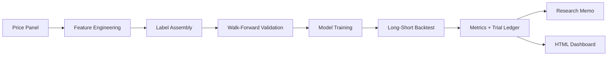

## Alpha Research Pipeline

[](https://www.python.org/downloads/)
[](tests/)
[](https://plotly.com/python/)
[](artifacts/demo/)

A research project and reproducible pipeline for statistically rigorous cross-sectional alpha research. The system engineers lagged factors, purged walk-forward validation, cost-aware long-short backtesting, explicit trial logging, deflated Sharpe reporting, and an HTML research dashboard — all from persisted experiment artifacts.

---

## Problem Statement

Quantitative research pipelines often optimize for a single attractive backtest while under-reporting how many model variants were tried, how validation was structured, and whether results survive multiple-testing correction. A headline Sharpe ratio without disclosed trials, purged folds, or transaction costs is difficult to defend in production.

Alpha Research Pipeline treats statistical rigor as the primary deliverable. It logs every tested variant, validates out of sample with walk-forward splits, applies deflated Sharpe against the full search space, and documents data limitations before any live claim.

## Research Results

The following results were captured from the reproducible demo experiment at `artifacts/demo/`, generated from deterministic synthetic market data. All figures in the HTML dashboard load from `metrics.json` — nothing is hardcoded.

### Configuration

| Parameter | Value |
|---|---|
| Experiment | `demo_synthetic_cross_section` |
| Universe | 40 synthetic liquid equities |
| Sample | 2018-01-01 to 2021-06-11 |
| Rows | 36,000 |
| Features | 16 lagged cross-sectional factors |
| Models | linear ridge, histogram boosting |
| Train window | 504 days |
| Test window | 63 days |
| Step | 63 days |
| Embargo | 5 days |
| Rebalance | W-FRI |
| Transaction cost | 5.0 bps |
| Trials disclosed | 2 |
| Survivorship-bias-free | No |

### Variant Comparison

Out-of-sample performance after walk-forward validation and multiple-testing correction.

| Variant | Raw Sharpe | Deflated Sharpe | DSR Probability | Mean Rank IC | Max Drawdown | Turnover |
|---|---:|---:|---:|---:|---:|---:|
| boosting_hist_depth_3 | 0.02 | 0.04 | 78.3% | 0.019 | -9.1% | 0.205 |
| linear_ridge_alpha_1 | -0.28 | -0.26 | 0.0% | -0.002 | -10.7% | 0.149 |

### Best Variant Detail

| Metric | Value |
|---|---|
| Best variant | `boosting_hist_depth_3` |
| Raw Sharpe | 0.02 |
| Deflated Sharpe | 0.04 |
| DSR probability | 78.3% |
| Mean rank IC | 0.019 |
| ICIR | 1.91 |
| Annualized return | -0.06% |
| Average turnover | 0.205 |
| Max drawdown | -9.1% |

### Cost Sensitivity

Net performance for the best variant under alternate transaction-cost assumptions (from `returns.parquet`).

| Cost (bps) | Total Return | Sharpe |
|---:|---:|---:|
| 5 | -0.09% | 0.02 |
| 10 | -0.18% | 0.01 |
| 20 | -0.36% | -0.01 |

### Interpretation

The useful result is not a standalone Sharpe ratio. The useful result is the gap between raw performance and the deflated result after disclosing all tested variants. In this demo, `boosting_hist_depth_3` shows a modest positive deflated Sharpe and high DSR probability relative to the linear baseline, but absolute performance remains small.

> **Note on data limitations:** The built-in demo uses synthetic data for full reproducibility without API keys or data-vendor credentials. The universe is not survivorship-bias-free and is not a substitute for institutional point-in-time data. The pipeline proves the research machinery — leakage controls, validation, backtesting, statistics, and reporting — not live equity alpha.

## Usage

### Run the Demo Experiment

```bash
python -m alpha_pipeline.cli --output artifacts/demo
```

### View the Research Dashboard

```bash
python -m dashboard serve
```

Open **http://127.0.0.1:8765/index.html**

### Generate a Static HTML Report

```bash
python -m dashboard build --output reports/dashboard.html --experiment demo
```

### Print the Research Memo

```bash
python -m alpha_pipeline.memo artifacts/demo
```

## How It Works

The pipeline runs end to end from synthetic or pluggable price data through artifact-backed reporting:



1. **Ingest** — load a long-form price/volume panel and audit data quality flags.
2. **Engineer** — build lagged cross-sectional factors normalized by date with leakage controls.
3. **Validate** — train on prior dates only, purge overlapping labels, and score forward test blocks.
4. **Trade** — simulate a dollar-neutral long-short quantile portfolio with flat transaction costs.
5. **Disclose** — log every tested variant, compute deflated Sharpe, and persist artifacts.
6. **Report** — render a research memo and HTML dashboard from saved outputs.

## Installation

### Prerequisites

- Python 3.10 or later
- No API keys required for the synthetic demo

### Setup

```bash
git clone https://github.com/knokvik/alpha-research-pipeline.git
cd alpha-research-pipeline

python3 -m venv .venv
source .venv/bin/activate

pip install -e ".[dev]"
```

Optional model backends:

```bash
pip install -e ".[boosting]"
pip install -e ".[data]"
```

### Run Tests

```bash
pytest
```

Expected result: **10/10 tests passed**.

## CLI Reference

| Command | Description |
|---|---|
| `python -m alpha_pipeline.cli --output artifacts/demo` | Run the demo experiment and write artifacts |
| `python -m alpha_pipeline.memo artifacts/demo` | Render the research memo to stdout |
| `python -m alpha_pipeline.memo artifacts/demo --output reports/generated/demo_memo.md` | Write memo to file |
| `python -m dashboard build` | Generate `artifacts/dashboard/index.html` |
| `python -m dashboard build --output reports/dashboard.html` | Generate a standalone HTML report |
| `python -m dashboard serve` | Generate HTML and serve on localhost |
| `python -m dashboard serve --port 8080 --experiment demo` | Serve on a custom port |
| `pytest` | Run the test suite |

## Artifact Outputs

Each experiment run writes a self-contained artifact directory:

| File | Description |
|---|---|
| `metrics.json` | Aggregate experiment metrics and variant comparison |
| `trial_ledger.json` | Full trial log for multiple-testing disclosure |
| `folds.json` | Walk-forward fold boundaries and purge counts |
| `config.json` | Run configuration persisted at experiment time |
| `returns.parquet` | Daily gross returns and turnover by variant |
| `fold_scores.parquet` | Out-of-sample scores per validation fold |
| `features.parquet` | Engineered factor matrix |
| `labels.parquet` | Forward-return labels |
| `dataset.parquet` | Merged modeling dataset |

## Tested Configuration

| Component | Version |
|---|---|
| Python | 3.11 |
| NumPy | 1.24+ |
| pandas | 2.0+ |
| scikit-learn | 1.3+ |
| Plotly | 5.18+ |
| Demo seed | 7 |
| Tests | 10/10 passed |

## Project Layout

```text
src/alpha_pipeline/     Core research pipeline package
dashboard/              HTML report builder + localhost server
tests/                  Unit and integration tests
reports/                Memo template and generated research notes
artifacts/              Local experiment outputs (gitignored)
```

## Research Question

Can a small cross-sectional factor set produce a statistically defensible out-of-sample long-short signal after walk-forward validation, transaction costs, and multiple-testing correction?

The demo answer is intentionally modest: the pipeline is built to document *how* that question is tested, not to claim a production-ready alpha signal on synthetic data.